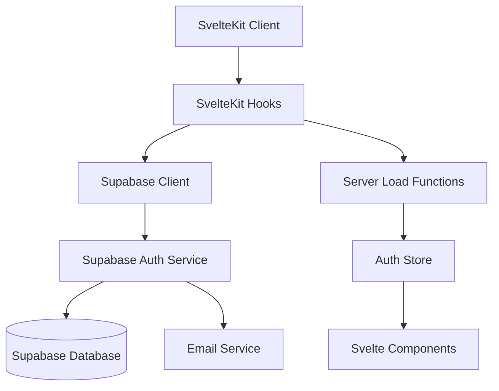
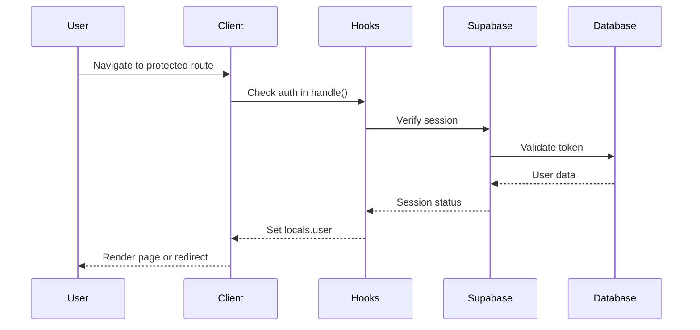

# Design Document

## Overview

The Supabase authentication system for VowsMarry will provide a comprehensive authentication solution that integrates seamlessly with SvelteKit's server-side rendering capabilities. The design leverages Supabase Auth's built-in features for user management, email verification, and session handling while providing a smooth user experience through proper state management and route protection.

The system will be built around SvelteKit's load functions and hooks to ensure authentication state is properly handled on both server and client sides, preventing hydration mismatches and providing secure access control.

## Architecture

### High-Level Architecture



### Authentication Flow



## Components and Interfaces

### 1. Supabase Client Configuration

**File:** `src/lib/supabase.ts`

The Supabase client will be configured with proper TypeScript types and environment variables:

```typescript
interface SupabaseConfig {
  url: string;
  anonKey: string;
  cookieOptions: {
    name: string;
    lifetime: number;
    domain?: string;
    path: string;
    sameSite: 'lax' | 'strict' | 'none';
  };
}
```

### 2. Authentication Store

**File:** `src/lib/stores/auth.ts`

A Svelte store that manages authentication state across the application:

```typescript
interface AuthState {
  user: User | null;
  session: Session | null;
  loading: boolean;
  initialized: boolean;
}

interface AuthStore extends Readable<AuthState> {
  signUp: (email: string, password: string) => Promise<AuthResponse>;
  signIn: (email: string, password: string) => Promise<AuthResponse>;
  signOut: () => Promise<void>;
  resetPassword: (email: string) => Promise<void>;
  updateProfile: (updates: UserAttributes) => Promise<void>;
}
```

### 3. Authentication Hooks

**File:** `src/hooks.server.ts`

Server-side hooks that handle authentication on every request:

```typescript
interface AuthHooks {
  handle: (input: { event: RequestEvent; resolve: ResolveFunction }) => Promise<Response>;
  getSession: (event: RequestEvent) => Promise<Session | null>;
  setSessionCookies: (event: RequestEvent, session: Session) => void;
}
```

### 4. Route Protection Utilities

**File:** `src/lib/auth/guards.ts`

Utilities for protecting routes and handling redirects:

```typescript
interface RouteGuard {
  requireAuth: (url: URL) => boolean;
  getRedirectUrl: (url: URL, isAuthenticated: boolean) => string | null;
  isPublicRoute: (pathname: string) => boolean;
}
```

### 5. Authentication Components

**Components:**
- `LoginForm.svelte` - Login form with validation
- `RegisterForm.svelte` - Registration form with validation  
- `PasswordResetForm.svelte` - Password reset form
- `EmailVerification.svelte` - Email verification status
- `ProfileForm.svelte` - Profile update form
- `AuthGuard.svelte` - Component-level route protection

### 6. Authentication Pages

**Routes:**
- `src/routes/(auth)/login/+page.svelte` - Login page
- `src/routes/(auth)/register/+page.svelte` - Registration page
- `src/routes/(auth)/reset-password/+page.svelte` - Password reset page
- `src/routes/(auth)/verify/+page.svelte` - Email verification page
- `src/routes/(auth)/profile/+page.svelte` - Profile management page

## Data Models

### User Profile Extension

While Supabase Auth handles core user data, we'll extend it with application-specific profile information:

```typescript
interface UserProfile {
  id: string; // matches auth.users.id
  email: string;
  full_name?: string;
  avatar_url?: string;
  partner_name?: string;
  wedding_date?: string;
  created_at: string;
  updated_at: string;
}
```

### Session Management

```typescript
interface SessionData {
  access_token: string;
  refresh_token: string;
  expires_at: number;
  user: User;
}
```

## Error Handling

### Authentication Error Types

```typescript
enum AuthErrorType {
  INVALID_CREDENTIALS = 'invalid_credentials',
  EMAIL_NOT_VERIFIED = 'email_not_verified',
  WEAK_PASSWORD = 'weak_password',
  EMAIL_ALREADY_EXISTS = 'email_already_exists',
  SESSION_EXPIRED = 'session_expired',
  NETWORK_ERROR = 'network_error',
  UNKNOWN_ERROR = 'unknown_error'
}

interface AuthError {
  type: AuthErrorType;
  message: string;
  details?: any;
}
```

### Error Handling Strategy

1. **Client-side errors:** Display user-friendly messages with retry options
2. **Server-side errors:** Log errors and return appropriate HTTP status codes
3. **Network errors:** Implement retry logic with exponential backoff
4. **Validation errors:** Show field-specific error messages

### Error Recovery

- Automatic token refresh for expired sessions
- Graceful degradation when Supabase is unavailable
- Offline state detection and appropriate messaging

## Testing Strategy

### Unit Tests

1. **Authentication Store Tests**
   - Test all store methods (signUp, signIn, signOut, etc.)
   - Test state transitions and error handling
   - Mock Supabase client responses

2. **Utility Function Tests**
   - Test route protection logic
   - Test redirect URL generation
   - Test session validation

3. **Component Tests**
   - Test form validation and submission
   - Test error message display
   - Test loading states

### Integration Tests

1. **Authentication Flow Tests**
   - End-to-end registration flow
   - Login and logout flows
   - Password reset flow
   - Email verification flow

2. **Route Protection Tests**
   - Test access to protected routes
   - Test redirect behavior
   - Test session persistence

3. **Server-Side Tests**
   - Test hooks.server.ts functionality
   - Test load function authentication checks
   - Test cookie handling

### E2E Tests

1. **User Journey Tests**
   - Complete user registration and verification
   - Login, navigate dashboard, logout
   - Password reset and recovery
   - Profile updates

2. **Cross-Browser Tests**
   - Test authentication across different browsers
   - Test session persistence
   - Test cookie behavior

## Security Considerations

### Session Security

1. **Secure Cookie Configuration**
   - HttpOnly cookies for refresh tokens
   - Secure flag for HTTPS
   - SameSite protection against CSRF

2. **Token Management**
   - Short-lived access tokens (1 hour)
   - Automatic token refresh
   - Secure token storage

### Route Protection

1. **Server-Side Validation**
   - All protected routes validate on server
   - No client-side only protection
   - Proper error handling for invalid sessions

2. **CSRF Protection**
   - SvelteKit's built-in CSRF protection
   - Proper form action handling
   - State parameter validation

### Data Validation

1. **Input Sanitization**
   - Email format validation
   - Password strength requirements
   - XSS prevention in user inputs

2. **Rate Limiting**
   - Login attempt rate limiting
   - Password reset rate limiting
   - Registration rate limiting

## Performance Considerations

### Client-Side Performance

1. **Lazy Loading**
   - Load authentication components on demand
   - Defer non-critical authentication checks

2. **Caching Strategy**
   - Cache user profile data
   - Minimize redundant API calls
   - Efficient state updates

### Server-Side Performance

1. **Session Caching**
   - Cache valid sessions to reduce database calls
   - Implement session invalidation strategy

2. **Database Optimization**
   - Proper indexing on user lookup fields
   - Efficient query patterns
   - Connection pooling

## Implementation Phases

### Phase 1: Core Authentication
- Supabase client setup
- Basic login/logout functionality
- Route protection hooks
- Authentication store

### Phase 2: User Management
- Registration with email verification
- Password reset functionality
- Profile management
- Error handling

### Phase 3: Enhanced Features
- Remember me functionality
- Social authentication (future)
- Advanced security features
- Performance optimizations

### Phase 4: Testing & Polish
- Comprehensive test suite
- Error boundary implementation
- Accessibility improvements
- Documentation