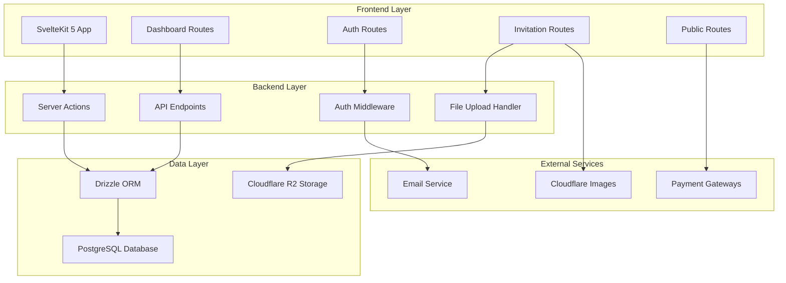
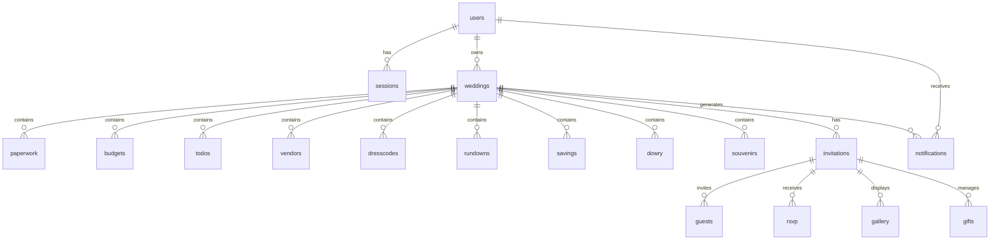

# Design Document

## Overview

The VowsMarry Wedding Planner Dashboard is a comprehensive SaaS platform built with SvelteKit 5, providing couples with a centralized hub for managing all aspects of their wedding planning. The system follows a modular architecture where each wedding planning aspect (paperwork, budgeting, todos, vendors, dresscode, savings, dowry, souvenirs, rundown, invitations, gallery, love story, and gifts) is implemented as a separate module with shared components and data models.

The platform uses a modern tech stack with SvelteKit 5 for the frontend, Drizzle ORM with PostgreSQL for data persistence, Cloudflare R2 for secure file storage, and Lucia for authentication. The design emphasizes user experience, data security, responsive design across all devices, and scalability to handle multiple concurrent users planning their weddings.

**Key Design Principles:**
- **Modular Architecture**: Each wedding planning aspect is a self-contained module with clear interfaces
- **Responsive Design**: Optimized for mobile, tablet, and desktop experiences (Requirement 7)
- **Security First**: Secure authentication, file storage, and data protection (Requirement 15)
- **Real-time Updates**: Live progress tracking and notifications across all modules
- **Integration Focus**: Seamless data flow between modules (savings ↔ budget, vendors ↔ souvenirs, dresscode ↔ invitations)

## Architecture

### System Architecture



### Route Architecture

The application follows SvelteKit's file-based routing with grouped routes designed for optimal user experience and security:

- `(auth)/` - Authentication pages (login, register, verify, password reset) with email verification (Requirement 15.1, 15.5)
- `(dashboard)/` - Protected wedding planner modules with session management (Requirement 15.2, 15.4)
  - `/dashboard` - Main dashboard with progress overview (Requirement 1)
  - `/dashboard/paperwork` - Document management (Requirement 2)
  - `/dashboard/budget` - Budget planning and tracking (Requirement 3)
  - `/dashboard/todos` - Task management (Requirement 4)
  - `/dashboard/vendors` - Vendor relationship management (Requirement 5)
  - `/dashboard/rundown` - Wedding day timeline (Requirement 6)
  - `/dashboard/dresscode` - Dresscode planning (Requirement 8)
  - `/dashboard/savings` - Savings tracking (Requirement 9)
  - `/dashboard/dowry` - Dowry management (Requirement 10)
  - `/dashboard/souvenirs` - Souvenir planning (Requirement 11)
- `(invitation)/` - Invitation creation and management (Requirement 12)
- `(public)/` - Public invitation pages for guests with RSVP functionality (Requirement 12.4, 13.3, 14.1)
- `api/` - API endpoints for data operations with proper authentication and validation

**Responsive Design Strategy**: All routes implement mobile-first responsive design with touch-optimized interfaces for mobile devices, adaptive layouts for tablets, and full-featured interfaces for desktop (Requirement 7.1, 7.2, 7.3).

**Offline Support and Data Synchronization**: The application implements progressive web app (PWA) capabilities with service workers for offline functionality. Essential data is cached locally, and appropriate offline messaging is displayed when connectivity is unavailable. Data synchronization occurs automatically when connection is restored (Requirement 7.4, 7.5).

### Database Architecture

The database schema is designed with clear separation between user management, wedding planning modules, and invitation features:



### Notification and Alert System

The platform implements a comprehensive notification system to keep users informed of important deadlines, updates, and actions across all modules:

**Notification Types:**
- **Deadline Alerts**: Document due dates, task deadlines, payment schedules (Requirements 2.3, 4.3)
- **Progress Updates**: Module completion status, milestone achievements (Requirement 1.4, 1.5)
- **Budget Warnings**: Overspending alerts, approaching limits (Requirement 3.4)
- **System Notifications**: RSVP updates, guest interactions, vendor communications (Requirements 5.5, 12.5)
- **Integration Alerts**: Dresscode updates to guests, savings goal adjustments (Requirements 8.5, 9.5)

**Delivery Mechanisms:**
- In-app notifications with real-time updates
- Email notifications for critical deadlines
- Dashboard highlights for urgent items (Requirement 1.5)
- Mobile-optimized notification display (Requirement 7.1)

### Module Integration Architecture

The system implements seamless integration between modules to provide a cohesive wedding planning experience:

**Cross-Module Data Flow:**
- **Budget ↔ Vendors**: Vendor costs automatically update budget tracking (Requirement 5.2, 3.2)
- **Budget ↔ Souvenirs**: Souvenir expenses integrate with budget categories (Requirement 11.4)
- **Savings ↔ Budget**: Savings progress influences budget recommendations and affordability (Requirement 9.4)
- **Dresscode ↔ Invitations**: Dresscode guidelines display on guest invitation pages (Requirement 8.4)
- **Vendors ↔ Rundown**: Vendor assignments link to timeline events (Requirement 6.2)
- **Guests ↔ Souvenirs**: Guest lists integrate with souvenir distribution tracking (Requirement 11.5)
- **Tasks ↔ Dashboard**: Task completion updates overall progress indicators (Requirement 4.5)

**Integration Benefits:**
- Eliminates duplicate data entry across modules
- Provides real-time updates when related data changes
- Enables comprehensive reporting and analytics
- Maintains data consistency across the platform

### Export and Reporting System

The platform provides comprehensive export functionality across multiple modules to support documentation and sharing needs:

**Export Capabilities:**
- **Budget Reports**: CSV and PDF export for financial tracking and vendor negotiations (Requirement 3.5)
- **Rundown Schedules**: PDF export for timeline distribution to vendors and wedding party (Requirement 6.4)
- **Dowry Documentation**: Legal and religious documentation export for official purposes (Requirement 10.5)
- **Guest Lists**: CSV export for vendor coordination and communication (Requirement 12.3)
- **RSVP Reports**: Real-time response tracking and analytics export (Requirement 12.5)
- **Gift Tracking**: Contribution reports and thank-you management export (Requirement 14.4)

**Export Features:**
- Multiple format support (PDF, CSV, Excel)
- Customizable report templates
- Automated report generation for recurring needs
- Secure download links with expiration
- Mobile-optimized export interfaces

## Components and Interfaces

### Core Components

#### 1. Dashboard Layout Component
- **Purpose**: Provides consistent navigation and layout for all dashboard pages
- **Features**: Sidebar navigation, breadcrumbs, user menu, notifications
- **Props**: Current page, user data, notification count
- **State**: Sidebar collapsed/expanded, active module

#### 2. Module Card Component
- **Purpose**: Displays overview information for each wedding planning module
- **Features**: Progress indicators, quick actions, recent items, alerts
- **Props**: Module type, data summary, permissions
- **State**: Loading, error, data refresh

#### 3. Data Table Component
- **Purpose**: Reusable table for displaying lists (documents, tasks, vendors, etc.)
- **Features**: Sorting, filtering, pagination, bulk actions, export
- **Props**: Columns definition, data source, actions
- **State**: Sort order, filters, selected items

#### 4. Form Components
- **Purpose**: Consistent form handling across all modules
- **Features**: Validation, file upload, auto-save, error handling
- **Props**: Schema, initial values, submit handler
- **State**: Form data, validation errors, submission status

#### 5. File Upload Component
- **Purpose**: Handle document and media uploads
- **Features**: Drag & drop, progress tracking, preview, validation
- **Props**: Accept types, max size, multiple files
- **State**: Upload progress, file list, errors

### Module-Specific Components

#### Dashboard Module
- **DashboardOverview**: Main dashboard with module summaries
- **ProgressChart**: Visual progress tracking across modules
- **UpcomingDeadlines**: List of approaching deadlines
- **QuickActions**: Fast access to common tasks

#### Paperwork Module
- **DocumentList**: Table of all documents with status
- **DocumentUpload**: File upload with metadata
- **DocumentViewer**: Preview documents in-browser
- **StatusTracker**: Visual status progression

#### Budgeting Module
- **BudgetOverview**: Total budget vs spending visualization
- **CategoryBreakdown**: Spending by category charts
- **BudgetForm**: Add/edit budget items
- **ExpenseTracker**: Log actual expenses

#### Todo Module
- **TaskBoard**: Kanban-style task organization
- **TaskForm**: Create/edit tasks with assignments
- **TaskFilters**: Filter by status, assignee, due date
- **TaskCalendar**: Calendar view of tasks

#### Vendor Module
- **VendorDirectory**: Searchable vendor list
- **VendorProfile**: Detailed vendor information
- **ContractManager**: Upload and track contracts
- **VendorRating**: Rate and review system

#### Dresscode Module
- **DresscodeGallery**: Display dresscode plans by event
- **DresscodeEditor**: Create and edit dresscode guidelines
- **InspirationUpload**: Upload and organize inspiration photos
- **DresscodeShare**: Share guidelines with guests via invitations

#### Savings Module
- **SavingsTracker**: Visual progress toward wedding savings goal with projections
- **SavingsForm**: Log deposits and withdrawals with categorization
- **SavingsChart**: Historical savings progress visualization with milestone tracking
- **BudgetIntegration**: Real-time budget affordability updates based on savings progress (Requirement 9.4)
- **GoalAdjustment**: Automatic budget and timeline recommendations when behind savings goals (Requirement 9.5)

#### Dowry Module
- **DowryList**: Table of all dowry items by type
- **DowryForm**: Add dowry items with proof uploads
- **DowryCalculator**: Calculate total dowry value
- **DowryExport**: Generate reports for documentation

#### Souvenir Module
- **SouvenirPlanner**: Plan souvenir types and quantities
- **SouvenirTracker**: Track order and distribution status
- **VendorIntegration**: Link souvenirs to vendor management
- **DistributionList**: Manage guest souvenir assignments

#### Rundown Module
- **TimelineEditor**: Create hour-by-hour wedding schedule with conflict detection
- **EventForm**: Add events with time, location, and responsibilities
- **ResponsibilityAssigner**: Assign tasks to wedding party members
- **ConflictDetector**: Identify scheduling conflicts and overlapping events (Requirement 6.5)
- **RundownExport**: Generate PDF schedules for distribution

#### Invitation Module
- **TemplateGallery**: Browse and select invitation templates
- **InvitationEditor**: Customize invitation design and content
- **CoupleDetailsForm**: Input bride, groom, and family information
- **EventDetailsForm**: Add ceremony and reception information
- **GuestManager**: Manage guest list with contact information
- **RSVPTracker**: Real-time RSVP monitoring and analytics
- **InvitationPreview**: Preview invitation before publishing
- **GuestInvitationView**: Public invitation page for guests

#### Gallery Module
- **MediaUploader**: Upload photos and videos with optimization
- **GalleryOrganizer**: Organize media by event or category
- **MediaViewer**: Display photos and videos in gallery format
- **GuestUpload**: Allow guests to contribute their own photos with moderation (Requirement 13.5)
- **MediaOptimizer**: Automatic image and video optimization for web viewing (Requirement 13.4)

#### Love Story Module
- **StoryTimeline**: Create chronological love story
- **StoryEditor**: Rich text editor for story content
- **MediaIntegration**: Embed photos and videos in story
- **StoryPreview**: Preview story as guests will see it

#### Gifts Module
- **DigitalEnvelope**: Set up bank transfer and QRIS options
- **GiftRegistry**: Integrate with external registry platforms
- **GiftTracker**: Monitor received gifts and contributions
- **ThankYouManager**: Send thank you messages to gift givers

### API Interfaces

#### Authentication API
```typescript
interface AuthAPI {
  register(userData: RegisterData): Promise<AuthResult>
  login(credentials: LoginData): Promise<AuthResult>
  logout(): Promise<void>
  verifyEmail(token: string): Promise<VerificationResult>
  resetPassword(email: string): Promise<void>
}
```

#### Wedding Data API
```typescript
interface WeddingAPI {
  getWedding(id: string): Promise<Wedding>
  updateWedding(id: string, data: WeddingUpdate): Promise<Wedding>
  deleteWedding(id: string): Promise<void>
}
```

#### Module APIs
```typescript
interface PaperworkAPI {
  getDocuments(): Promise<Document[]>
  uploadDocument(file: File, metadata: DocumentMetadata): Promise<Document>
  updateDocumentStatus(id: string, status: DocumentStatus): Promise<Document>
  deleteDocument(id: string): Promise<void>
}

interface BudgetAPI {
  getBudget(): Promise<BudgetSummary>
  addBudgetItem(item: BudgetItem): Promise<BudgetItem>
  updateBudgetItem(id: string, item: BudgetItemUpdate): Promise<BudgetItem>
  deleteBudgetItem(id: string): Promise<void>
  exportBudget(format: 'csv' | 'pdf'): Promise<Blob>
}

interface TodoAPI {
  getTodos(filters?: TodoFilters): Promise<Todo[]>
  createTodo(todo: CreateTodoData): Promise<Todo>
  updateTodo(id: string, updates: TodoUpdate): Promise<Todo>
  deleteTodo(id: string): Promise<void>
  assignTodo(id: string, assigneeId: string): Promise<Todo>
}

interface VendorAPI {
  getVendors(category?: string): Promise<Vendor[]>
  createVendor(vendor: CreateVendorData): Promise<Vendor>
  updateVendor(id: string, updates: VendorUpdate): Promise<Vendor>
  deleteVendor(id: string): Promise<void>
  uploadContract(vendorId: string, file: File): Promise<string>
  rateVendor(id: string, rating: number, review?: string): Promise<Vendor>
}

interface DresscodeAPI {
  getDresscodes(): Promise<Dresscode[]>
  createDresscode(dresscode: CreateDresscodeData): Promise<Dresscode>
  updateDresscode(id: string, updates: DresscodeUpdate): Promise<Dresscode>
  deleteDresscode(id: string): Promise<void>
  uploadInspiration(dresscodeId: string, files: File[]): Promise<string[]>
}

interface SavingsAPI {
  getSavings(): Promise<SavingsSummary>
  addSavingsEntry(entry: SavingsEntry): Promise<SavingsEntry>
  updateSavingsGoal(goal: number): Promise<SavingsSummary>
  getSavingsHistory(): Promise<SavingsEntry[]>
}

interface DowryAPI {
  getDowryItems(): Promise<DowryItem[]>
  addDowryItem(item: CreateDowryData): Promise<DowryItem>
  updateDowryItem(id: string, updates: DowryUpdate): Promise<DowryItem>
  deleteDowryItem(id: string): Promise<void>
  uploadProof(itemId: string, file: File): Promise<string>
  exportDowryReport(): Promise<Blob>
}

interface SouvenirAPI {
  getSouvenirs(): Promise<Souvenir[]>
  createSouvenir(souvenir: CreateSouvenirData): Promise<Souvenir>
  updateSouvenir(id: string, updates: SouvenirUpdate): Promise<Souvenir>
  deleteSouvenir(id: string): Promise<void>
  trackDistribution(id: string, guestId: string): Promise<void>
}

interface RundownAPI {
  getRundown(): Promise<RundownEvent[]>
  createEvent(event: CreateEventData): Promise<RundownEvent>
  updateEvent(id: string, updates: EventUpdate): Promise<RundownEvent>
  deleteEvent(id: string): Promise<void>
  assignResponsibility(eventId: string, assigneeId: string): Promise<RundownEvent>
  exportRundown(): Promise<Blob>
}

interface InvitationAPI {
  getInvitations(): Promise<Invitation[]>
  createInvitation(invitation: CreateInvitationData): Promise<Invitation>
  updateInvitation(id: string, updates: InvitationUpdate): Promise<Invitation>
  deleteInvitation(id: string): Promise<void>
  publishInvitation(id: string): Promise<Invitation>
  getInvitationBySlug(slug: string): Promise<PublicInvitation>
}

interface GuestAPI {
  getGuests(invitationId: string): Promise<Guest[]>
  addGuest(guest: CreateGuestData): Promise<Guest>
  updateGuest(id: string, updates: GuestUpdate): Promise<Guest>
  deleteGuest(id: string): Promise<void>
  sendInvitation(guestId: string): Promise<void>
  importGuests(invitationId: string, file: File): Promise<Guest[]>
}

interface RSVPAPI {
  getRSVPs(invitationId: string): Promise<RSVP[]>
  submitRSVP(guestToken: string, rsvp: RSVPData): Promise<RSVP>
  updateRSVP(id: string, updates: RSVPUpdate): Promise<RSVP>
  getRSVPStats(invitationId: string): Promise<RSVPStats>
}

interface GalleryAPI {
  getGalleryItems(invitationId: string): Promise<GalleryItem[]>
  uploadMedia(invitationId: string, files: File[]): Promise<GalleryItem[]>
  updateGalleryItem(id: string, updates: GalleryUpdate): Promise<GalleryItem>
  deleteGalleryItem(id: string): Promise<void>
  reorderGallery(invitationId: string, itemIds: string[]): Promise<void>
}

interface GiftAPI {
  getGiftOptions(invitationId: string): Promise<GiftOption[]>
  setupDigitalEnvelope(invitationId: string, bankInfo: BankInfo): Promise<GiftOption>
  setupGiftRegistry(invitationId: string, registryInfo: RegistryInfo): Promise<GiftOption>
  getGiftContributions(invitationId: string): Promise<GiftContribution[]>
  sendThankYou(contributionId: string, message: string): Promise<void>
}

interface LoveStoryAPI {
  getLoveStory(invitationId: string): Promise<LoveStoryItem[]>
  addStoryItem(item: CreateStoryData): Promise<LoveStoryItem>
  updateStoryItem(id: string, updates: StoryUpdate): Promise<LoveStoryItem>
  deleteStoryItem(id: string): Promise<void>
  reorderStory(invitationId: string, itemIds: string[]): Promise<void>
}
```

#### API Data Transfer Objects

```typescript
// Authentication DTOs
interface RegisterData {
  email: string
  password: string
  firstName: string
  lastName: string
}

interface LoginData {
  email: string
  password: string
}

interface AuthResult {
  user: User
  session: Session
}

interface VerificationResult {
  success: boolean
  message: string
}

// Wedding Planning DTOs
interface WeddingUpdate {
  partnerName?: string
  weddingDate?: Date
  venue?: string
  budget?: number
  status?: 'planning' | 'active' | 'completed'
}

interface DocumentMetadata {
  title: string
  type: 'permit' | 'license' | 'contract' | 'other'
  dueDate?: Date
  notes?: string
}

interface BudgetSummary {
  totalPlanned: number
  totalActual: number
  categories: BudgetCategorySum[]
  items: BudgetItem[]
}

interface BudgetCategorySum {
  category: string
  planned: number
  actual: number
  variance: number
}

interface BudgetItemUpdate {
  category?: string
  description?: string
  plannedAmount?: number
  actualAmount?: number
  vendorId?: string
  dueDate?: Date
  status?: 'planned' | 'paid' | 'overdue'
}

interface TodoFilters {
  status?: 'todo' | 'in_progress' | 'done'
  assignedTo?: string
  priority?: 'low' | 'medium' | 'high'
  dueBefore?: Date
  dueAfter?: Date
}

interface CreateTodoData {
  title: string
  description?: string
  priority: 'low' | 'medium' | 'high'
  dueDate?: Date
  assignedTo?: string
}

interface TodoUpdate {
  title?: string
  description?: string
  status?: 'todo' | 'in_progress' | 'done'
  priority?: 'low' | 'medium' | 'high'
  dueDate?: Date
  assignedTo?: string
}

interface ContactInfo {
  phone?: string
  email?: string
  address?: string
  website?: string
}

interface CreateVendorData {
  name: string
  category: string
  contactInfo: ContactInfo
  notes?: string
}

interface VendorUpdate {
  name?: string
  category?: string
  contactInfo?: ContactInfo
  status?: 'contacted' | 'negotiating' | 'booked' | 'completed'
  notes?: string
}

interface CreateDresscodeData {
  eventName: string
  description: string
  colorScheme?: string[]
  dresscodeType: 'formal' | 'semi_formal' | 'casual' | 'traditional' | 'custom'
  guestInstructions?: string
}

interface DresscodeUpdate {
  eventName?: string
  description?: string
  colorScheme?: string[]
  dresscodeType?: 'formal' | 'semi_formal' | 'casual' | 'traditional' | 'custom'
  guestInstructions?: string
}

interface SavingsEntry {
  amount: number
  type: 'deposit' | 'withdrawal'
  description?: string
  date: Date
}

interface CreateDowryData {
  type: 'cash' | 'gold' | 'property' | 'jewelry' | 'other'
  description: string
  value: number
  currency: string
  notes?: string
}

interface DowryUpdate {
  description?: string
  value?: number
  currency?: string
  status?: 'promised' | 'received' | 'documented'
  notes?: string
}

interface CreateSouvenirData {
  name: string
  description?: string
  vendorId?: string
  quantity: number
  unitCost: number
  distributionPlan?: string
}

interface SouvenirUpdate {
  name?: string
  description?: string
  vendorId?: string
  quantity?: number
  unitCost?: number
  status?: 'planned' | 'ordered' | 'received' | 'distributed'
  distributionPlan?: string
}

interface CreateEventData {
  eventName: string
  startTime: Date
  endTime: Date
  location?: string
  description?: string
  assignedTo?: string[]
  requirements?: string[]
  notes?: string
}

interface EventUpdate {
  eventName?: string
  startTime?: Date
  endTime?: Date
  location?: string
  description?: string
  assignedTo?: string[]
  requirements?: string[]
  notes?: string
}

interface CreateInvitationData {
  slug: string
  template: string
  coupleDetails: CoupleDetails
  eventDetails: EventDetails
}

interface InvitationUpdate {
  slug?: string
  template?: string
  coupleDetails?: Partial<CoupleDetails>
  eventDetails?: Partial<EventDetails>
  status?: 'draft' | 'published' | 'expired'
  expiresAt?: Date
}

interface PublicInvitation {
  invitation: Invitation
  dresscode?: Dresscode
  gallery: GalleryItem[]
  loveStory: LoveStoryItem[]
  giftOptions: GiftOption[]
}

interface CreateGuestData {
  invitationId: string
  name: string
  phone?: string
  email?: string
}

interface GuestUpdate {
  name?: string
  phone?: string
  email?: string
}

interface RSVPData {
  status: 'attending' | 'declined'
  plusOneCount: number
  mealPreferences: string[]
  specialRequests?: string
}

interface RSVPUpdate {
  status?: 'attending' | 'declined'
  plusOneCount?: number
  mealPreferences?: string[]
  specialRequests?: string
}

interface RSVPStats {
  totalInvited: number
  totalResponded: number
  totalAttending: number
  totalDeclined: number
  totalPending: number
  mealPreferenceCounts: Record<string, number>
}

interface GalleryUpdate {
  caption?: string
  sortOrder?: number
}

interface BankInfo {
  bankName: string
  accountName: string
  accountNumber: string
  qrCode?: string
}

interface RegistryInfo {
  platform: 'tokopedia' | 'shopee' | 'amazon' | 'custom'
  registryUrl: string
  registryId?: string
}

interface CreateStoryData {
  invitationId: string
  title: string
  content: string
  date?: Date
  mediaUrl?: string
  mediaType?: 'photo' | 'video'
}

interface StoryUpdate {
  title?: string
  content?: string
  date?: Date
  mediaUrl?: string
  mediaType?: 'photo' | 'video'
  sortOrder?: number
}
```

## Data Models

### Core Models

#### User Model
```typescript
interface User {
  id: string
  email: string
  firstName: string
  lastName: string
  emailVerified: boolean
  createdAt: Date
  updatedAt: Date
}
```

#### Wedding Model
```typescript
interface Wedding {
  id: string
  userId: string
  partnerName?: string
  weddingDate?: Date
  venue?: string
  budget?: number
  status: 'planning' | 'active' | 'completed'
  createdAt: Date
  updatedAt: Date
}
```

### Module Models

#### Paperwork Model
```typescript
interface Document {
  id: string
  weddingId: string
  title: string
  type: 'permit' | 'license' | 'contract' | 'other'
  status: 'pending' | 'approved' | 'rejected'
  dueDate?: Date
  fileUrl?: string
  fileName?: string
  fileSize?: number
  mimeType?: string
  notes?: string
  reminderSent?: boolean
  createdAt: Date
  updatedAt: Date
}

interface DocumentReminder {
  id: string
  documentId: string
  reminderDate: Date
  sent: boolean
  createdAt: Date
}
```

#### Budget Model
```typescript
interface BudgetItem {
  id: string
  weddingId: string
  category: string
  description: string
  plannedAmount: number
  actualAmount?: number
  vendorId?: string
  dueDate?: Date
  status: 'planned' | 'paid' | 'overdue'
  receiptUrl?: string
  paymentMethod?: string
  notes?: string
  createdAt: Date
  updatedAt: Date
}

interface BudgetCategory {
  id: string
  weddingId: string
  name: string
  allocatedAmount: number
  spentAmount: number
  color?: string
  description?: string
  createdAt: Date
  updatedAt: Date
}

interface BudgetAlert {
  id: string
  weddingId: string
  categoryId?: string
  type: 'overspend' | 'approaching_limit' | 'payment_due'
  message: string
  threshold: number
  isActive: boolean
  createdAt: Date
}
```

#### Todo Model
```typescript
interface Todo {
  id: string
  weddingId: string
  title: string
  description?: string
  status: 'todo' | 'in_progress' | 'done'
  priority: 'low' | 'medium' | 'high'
  dueDate?: Date
  assignedTo?: string
  assignedToName?: string
  completedAt?: Date
  completedBy?: string
  estimatedHours?: number
  actualHours?: number
  tags?: string[]
  dependencies?: string[]
  attachments?: string[]
  createdAt: Date
  updatedAt: Date
}

interface TodoComment {
  id: string
  todoId: string
  userId: string
  userName: string
  comment: string
  createdAt: Date
}

interface TodoSubtask {
  id: string
  todoId: string
  title: string
  completed: boolean
  completedAt?: Date
  sortOrder: number
  createdAt: Date
}
```

#### Vendor Model
```typescript
interface Vendor {
  id: string
  weddingId: string
  name: string
  category: string
  contactInfo: ContactInfo
  status: 'contacted' | 'negotiating' | 'booked' | 'completed'
  contractUrl?: string
  rating?: number
  review?: string
  totalCost?: number
  depositPaid?: number
  finalPaymentDue?: Date
  services?: string[]
  notes?: string
  tags?: string[]
  createdAt: Date
  updatedAt: Date
}

interface VendorCategory {
  id: string
  name: string
  description?: string
  icon?: string
  sortOrder: number
  isActive: boolean
}

interface VendorCommunication {
  id: string
  vendorId: string
  type: 'email' | 'phone' | 'meeting' | 'other'
  subject?: string
  content: string
  communicatedAt: Date
  followUpRequired?: boolean
  followUpDate?: Date
  createdAt: Date
}

interface VendorContract {
  id: string
  vendorId: string
  contractUrl: string
  signedDate?: Date
  expiryDate?: Date
  terms?: string
  totalAmount?: number
  paymentSchedule?: PaymentScheduleItem[]
  createdAt: Date
  updatedAt: Date
}

interface PaymentScheduleItem {
  id: string
  description: string
  amount: number
  dueDate: Date
  paid: boolean
  paidDate?: Date
}
```

#### Dresscode Model
```typescript
interface Dresscode {
  id: string
  weddingId: string
  eventName: string
  description: string
  colorScheme?: string[]
  dresscodeType: 'formal' | 'semi_formal' | 'casual' | 'traditional' | 'custom'
  inspirationImages: string[]
  guestInstructions?: string
  maleAttire?: AttireDetails
  femaleAttire?: AttireDetails
  childrenAttire?: AttireDetails
  weatherConsiderations?: string
  culturalRequirements?: string
  accessoryGuidelines?: string
  isPublic: boolean
  createdAt: Date
  updatedAt: Date
}

interface AttireDetails {
  clothing: string[]
  colors: string[]
  fabrics?: string[]
  accessories?: string[]
  footwear?: string[]
  restrictions?: string[]
}

interface DresscodeInspiration {
  id: string
  dresscodeId: string
  imageUrl: string
  description?: string
  source?: string
  tags?: string[]
  sortOrder: number
  createdAt: Date
}
```

#### Savings Model
```typescript
interface SavingsSummary {
  id: string
  weddingId: string
  goalAmount: number
  currentAmount: number
  targetDate?: Date
  monthlyTarget?: number
  autoSaveAmount?: number
  autoSaveFrequency?: 'weekly' | 'monthly' | 'biweekly'
  bankAccountId?: string
  interestRate?: number
  projectedCompletion?: Date
  createdAt: Date
  updatedAt: Date
}

interface SavingsEntry {
  id: string
  savingsId: string
  amount: number
  type: 'deposit' | 'withdrawal' | 'interest' | 'transfer'
  source?: 'manual' | 'auto_save' | 'gift' | 'bonus' | 'other'
  description?: string
  date: Date
  receiptUrl?: string
  bankTransactionId?: string
  createdAt: Date
}

interface SavingsGoal {
  id: string
  savingsId: string
  name: string
  targetAmount: number
  currentAmount: number
  priority: 'high' | 'medium' | 'low'
  targetDate?: Date
  category?: string
  description?: string
  achieved: boolean
  achievedDate?: Date
  createdAt: Date
  updatedAt: Date
}

interface SavingsMilestone {
  id: string
  savingsId: string
  amount: number
  description: string
  achieved: boolean
  achievedDate?: Date
  reward?: string
  createdAt: Date
}
```

#### Dowry Model
```typescript
interface DowryItem {
  id: string
  weddingId: string
  type: 'cash' | 'gold' | 'property' | 'jewelry' | 'vehicle' | 'electronics' | 'furniture' | 'other'
  subType?: string
  description: string
  value: number
  currency: string
  status: 'promised' | 'received' | 'documented' | 'verified'
  proofUrl?: string[]
  certificateUrl?: string
  appraisalUrl?: string
  giver: string
  giverRelation?: string
  receiver: string
  receiverRelation?: string
  witnessNames?: string[]
  religiousRequirement: boolean
  legalRequirement: boolean
  customaryRequirement: boolean
  location?: string
  receivedDate?: Date
  documentedDate?: Date
  notes?: string
  tags?: string[]
  createdAt: Date
  updatedAt: Date
}

interface DowryCategory {
  id: string
  name: string
  description?: string
  culturalSignificance?: string
  typicalValue?: number
  currency?: string
  isRequired: boolean
  sortOrder: number
}

interface DowryWitness {
  id: string
  dowryItemId: string
  name: string
  relation: string
  contactInfo?: ContactInfo
  signatureUrl?: string
  witnessedDate: Date
  createdAt: Date
}

interface DowryValuation {
  id: string
  dowryItemId: string
  valuedBy: string
  valuationType: 'professional' | 'market' | 'insurance' | 'family'
  valuedAmount: number
  currency: string
  valuationDate: Date
  certificateUrl?: string
  validUntil?: Date
  notes?: string
  createdAt: Date
}
```

#### Souvenir Model
```typescript
interface Souvenir {
  id: string
  weddingId: string
  name: string
  description?: string
  category: 'edible' | 'decorative' | 'practical' | 'religious' | 'custom'
  vendorId?: string
  vendorName?: string
  quantity: number
  unitCost: number
  totalCost: number
  status: 'planned' | 'ordered' | 'received' | 'distributed'
  orderDate?: Date
  expectedDelivery?: Date
  actualDelivery?: Date
  distributionPlan?: string
  distributionDate?: Date
  packaging?: PackagingDetails
  customization?: CustomizationDetails
  qualityCheck?: boolean
  qualityNotes?: string
  storageLocation?: string
  expiryDate?: Date
  tags?: string[]
  imageUrl?: string[]
  createdAt: Date
  updatedAt: Date
}

interface PackagingDetails {
  type: string
  color?: string
  material?: string
  customLabel?: boolean
  labelText?: string
  ribbonColor?: string
  specialInstructions?: string
}

interface CustomizationDetails {
  personalized: boolean
  coupleNames?: boolean
  weddingDate?: boolean
  customMessage?: string
  logoUrl?: string
  fontStyle?: string
  colorScheme?: string[]
}

interface SouvenirDistribution {
  id: string
  souvenirId: string
  guestId?: string
  guestName: string
  quantity: number
  distributedDate: Date
  distributedBy: string
  location: string
  notes?: string
  createdAt: Date
}

interface SouvenirInventory {
  id: string
  souvenirId: string
  batchNumber?: string
  quantityReceived: number
  quantityDistributed: number
  quantityRemaining: number
  qualityGrade?: 'A' | 'B' | 'C'
  defectCount?: number
  storageLocation: string
  lastUpdated: Date
}
```

#### Rundown Model
```typescript
interface RundownEvent {
  id: string
  weddingId: string
  eventName: string
  eventType: 'ceremony' | 'reception' | 'preparation' | 'photography' | 'transportation' | 'other'
  startTime: Date
  endTime: Date
  duration?: number
  location?: string
  venue?: string
  description?: string
  assignedTo?: string[]
  assignedRoles?: AssignedRole[]
  requirements?: string[]
  equipment?: string[]
  vendors?: string[]
  guestCount?: number
  dresscode?: string
  musicPlaylist?: string
  specialInstructions?: string
  backupPlan?: string
  status: 'planned' | 'confirmed' | 'in_progress' | 'completed' | 'cancelled'
  priority: 'high' | 'medium' | 'low'
  dependencies?: string[]
  bufferTime?: number
  notes?: string
  sortOrder: number
  createdAt: Date
  updatedAt: Date
}

interface AssignedRole {
  personName: string
  role: string
  contactInfo?: ContactInfo
  responsibilities: string[]
  arrivalTime?: Date
  briefingRequired?: boolean
}

interface RundownTemplate {
  id: string
  name: string
  description?: string
  category: 'traditional' | 'modern' | 'religious' | 'cultural' | 'custom'
  events: RundownEventTemplate[]
  estimatedDuration: number
  guestCountRange?: string
  culturalContext?: string
  isPublic: boolean
  createdBy?: string
  usageCount: number
  createdAt: Date
  updatedAt: Date
}

interface RundownEventTemplate {
  eventName: string
  eventType: string
  estimatedDuration: number
  description?: string
  requirements?: string[]
  typicalAssignments?: string[]
  sortOrder: number
}

interface RundownChecklist {
  id: string
  rundownEventId: string
  item: string
  completed: boolean
  completedBy?: string
  completedAt?: Date
  notes?: string
  sortOrder: number
  createdAt: Date
}

interface RundownConflict {
  id: string
  weddingId: string
  eventId1: string
  eventId2: string
  conflictType: 'time_overlap' | 'resource_conflict' | 'person_conflict' | 'venue_conflict'
  description: string
  severity: 'high' | 'medium' | 'low'
  resolved: boolean
  resolution?: string
  resolvedAt?: Date
  createdAt: Date
}
```

#### Invitation Model
```typescript
interface Invitation {
  id: string
  weddingId: string
  slug: string
  template: string
  coupleDetails: CoupleDetails
  eventDetails: EventDetails
  status: 'draft' | 'published' | 'expired'
  expiresAt?: Date
  createdAt: Date
  updatedAt: Date
}

interface CoupleDetails {
  brideName: string
  groomName: string
  brideParents?: ParentInfo[]
  groomParents?: ParentInfo[]
  greeting?: string
  loveStoryEnabled: boolean
  galleryEnabled: boolean
}

interface ParentInfo {
  name: string
  role: 'father' | 'mother' | 'guardian'
  side: 'bride' | 'groom'
}

interface EventDetails {
  ceremonyDate: Date
  ceremonyLocation: string
  ceremonyAddress: string
  receptionDate?: Date
  receptionLocation?: string
  receptionAddress?: string
  mapUrl?: string
  dresscodeId?: string
}

interface Guest {
  id: string
  invitationId: string
  name: string
  phone?: string
  email?: string
  token: string
  rsvpStatus: 'pending' | 'attending' | 'declined'
  plusOne?: boolean
  mealPreference?: string
  createdAt: Date
  updatedAt: Date
}

interface RSVP {
  id: string
  guestId: string
  invitationId: string
  status: 'attending' | 'declined'
  plusOneCount: number
  mealPreferences: string[]
  specialRequests?: string
  submittedAt: Date
}

interface GalleryItem {
  id: string
  invitationId: string
  type: 'photo' | 'video'
  url: string
  thumbnailUrl?: string
  caption?: string
  uploadedBy?: string
  sortOrder: number
  createdAt: Date
}

interface LoveStoryItem {
  id: string
  invitationId: string
  title: string
  content: string
  date?: Date
  mediaUrl?: string
  mediaType?: 'photo' | 'video'
  sortOrder: number
  createdAt: Date
  updatedAt: Date
}

interface GiftOption {
  id: string
  invitationId: string
  type: 'digital_envelope' | 'registry' | 'custom'
  provider?: string
  accountInfo?: Record<string, any>
  qrCode?: string
  instructions?: string
  isActive: boolean
  createdAt: Date
  updatedAt: Date
}

interface GiftContribution {
  id: string
  giftOptionId: string
  guestId?: string
  guestName: string
  amount?: number
  currency?: string
  message?: string
  isAnonymous: boolean
  contributedAt: Date
  paymentMethod?: string
  transactionId?: string
  status: 'pending' | 'completed' | 'failed' | 'refunded'
  thankYouSent?: boolean
  thankYouSentAt?: Date
}

interface WeddingMessage {
  id: string
  invitationId: string
  guestId?: string
  guestName: string
  message: string
  isPublic: boolean
  isApproved: boolean
  approvedAt?: Date
  createdAt: Date
}

interface InvitationTemplate {
  id: string
  name: string
  category: 'traditional' | 'modern' | 'islamic' | 'minimalist' | 'floral' | 'elegant'
  description?: string
  previewImageUrl: string
  templateData: Record<string, any>
  isPremium: boolean
  price?: number
  currency?: string
  customizationOptions: CustomizationOption[]
  usageCount: number
  rating?: number
  reviewCount: number
  createdBy?: string
  isActive: boolean
  createdAt: Date
  updatedAt: Date
}

interface CustomizationOption {
  key: string
  label: string
  type: 'color' | 'font' | 'text' | 'image' | 'boolean'
  defaultValue?: any
  options?: any[]
  required: boolean
  description?: string
}

interface InvitationAnalytics {
  id: string
  invitationId: string
  totalViews: number
  uniqueViews: number
  rsvpRate: number
  averageViewDuration?: number
  deviceBreakdown?: Record<string, number>
  locationBreakdown?: Record<string, number>
  peakViewingTimes?: Date[]
  socialShares: number
  lastUpdated: Date
}

interface NotificationPreference {
  id: string
  userId: string
  emailNotifications: boolean
  smsNotifications: boolean
  pushNotifications: boolean
  rsvpUpdates: boolean
  deadlineReminders: boolean
  budgetAlerts: boolean
  vendorCommunications: boolean
  guestMessages: boolean
  systemUpdates: boolean
  marketingEmails: boolean
  createdAt: Date
  updatedAt: Date
}

interface AuditLog {
  id: string
  userId: string
  weddingId?: string
  action: string
  entityType: string
  entityId: string
  oldValues?: Record<string, any>
  newValues?: Record<string, any>
  ipAddress?: string
  userAgent?: string
  createdAt: Date
}
```

## Error Handling

The platform implements comprehensive error handling and validation to ensure data integrity, security, and user experience:

### Input Validation and Security
- **Server-side Validation**: All user inputs validated using Zod schemas before database operations (Requirement 15.3)
- **File Upload Security**: File type validation, size limits, and malware scanning for document and media uploads (Requirement 15.3)
- **Authentication Security**: Secure session management with appropriate timeouts and CSRF protection (Requirement 15.2)
- **Data Access Control**: User-specific data isolation ensuring users can only access their own wedding information (Requirement 15.4)

### Error Recovery and User Experience
- **Graceful Degradation**: System continues to function with reduced capabilities during partial failures
- **Offline Error Handling**: Clear messaging when offline with automatic retry when connection restored (Requirement 7.5)
- **Form Validation**: Real-time client-side validation with server-side verification
- **File Upload Errors**: Progress tracking with retry mechanisms for failed uploads
- **Network Error Recovery**: Automatic retry logic for transient network issues

### Monitoring and Logging
- **Error Tracking**: Comprehensive logging of system errors and user actions for debugging
- **Performance Monitoring**: Real-time monitoring of response times and system health
- **Security Auditing**: Logging of authentication attempts and data access patterns
- **User Feedback**: Toast notifications and error messages with actionable guidance

### Client-Side Error Handling

#### Form Validation
```typescript
import { z } from 'zod'

// Validation schemas for different modules
const DocumentSchema = z.object({
  title: z.string().min(1, 'Title is required').max(100, 'Title too long'),
  type: z.enum(['permit', 'license', 'contract', 'other']),
  dueDate: z.date().optional(),
  file: z.instanceof(File).optional().refine(
    (file) => !file || file.size <= 10 * 1024 * 1024,
    'File size must be less than 10MB'
  )
})

const BudgetItemSchema = z.object({
  category: z.string().min(1, 'Category is required'),
  description: z.string().min(1, 'Description is required'),
  plannedAmount: z.number().positive('Amount must be positive'),
  actualAmount: z.number().nonnegative('Amount cannot be negative').optional()
})

// Form validation handler
class FormValidator {
  static validateField<T>(schema: z.ZodSchema<T>, field: string, value: any): string | null {
    try {
      schema.pick({ [field]: true }).parse({ [field]: value })
      return null
    } catch (error) {
      if (error instanceof z.ZodError) {
        return error.errors[0]?.message || 'Invalid input'
      }
      return 'Validation error'
    }
  }

  static validateForm<T>(schema: z.ZodSchema<T>, data: any): { isValid: boolean; errors: Record<string, string> } {
    try {
      schema.parse(data)
      return { isValid: true, errors: {} }
    } catch (error) {
      if (error instanceof z.ZodError) {
        const errors: Record<string, string> = {}
        error.errors.forEach((err) => {
          const path = err.path.join('.')
          errors[path] = err.message
        })
        return { isValid: false, errors }
      }
      return { isValid: false, errors: { general: 'Validation failed' } }
    }
  }
}
```

#### API Error Handling
```typescript
interface APIError {
  code: string
  message: string
  field?: string
  details?: Record<string, any>
  statusCode?: number
  timestamp?: string
}

interface ErrorResponse {
  error: APIError
  requestId?: string
  path?: string
}

class ErrorHandler {
  private static errorMessages: Record<string, string> = {
    'AUTH_REQUIRED': 'Please log in to continue',
    'AUTH_EXPIRED': 'Your session has expired. Please log in again',
    'PERMISSION_DENIED': 'You do not have permission to perform this action',
    'VALIDATION_ERROR': 'Please check your input and try again',
    'DUPLICATE_ENTRY': 'This item already exists',
    'NOT_FOUND': 'The requested item was not found',
    'RATE_LIMIT_EXCEEDED': 'Too many requests. Please try again later',
    'FILE_TOO_LARGE': 'File size exceeds the maximum limit',
    'INVALID_FILE_TYPE': 'File type is not supported',
    'STORAGE_QUOTA_EXCEEDED': 'Storage quota exceeded',
    'NETWORK_ERROR': 'Network connection error. Please check your internet connection',
    'SERVER_ERROR': 'Server error. Please try again later'
  }

  static handleAPIError(error: APIError, context?: string): void {
    const userMessage = this.errorMessages[error.code] || error.message || 'An unexpected error occurred'
    
    // Display user-friendly toast notification
    this.showToast(userMessage, 'error')
    
    // Log detailed error for debugging
    console.error('API Error:', {
      code: error.code,
      message: error.message,
      context,
      details: error.details,
      timestamp: new Date().toISOString()
    })

    // Handle specific error types
    switch (error.code) {
      case 'AUTH_REQUIRED':
      case 'AUTH_EXPIRED':
        this.redirectToLogin()
        break
      case 'PERMISSION_DENIED':
        this.showPermissionDeniedModal()
        break
      case 'VALIDATION_ERROR':
        this.highlightFormErrors(error.details)
        break
      case 'RATE_LIMIT_EXCEEDED':
        this.showRateLimitModal(error.details?.retryAfter)
        break
    }
  }

  static handleNetworkError(retryCallback?: () => void): void {
    this.showToast('Network connection error', 'error')
    
    // Show offline indicator
    this.setOfflineMode(true)
    
    // Queue request for retry when connection is restored
    if (retryCallback) {
      this.queueRetryRequest(retryCallback)
    }
  }

  static handleFileUploadError(error: APIError, fileName: string): void {
    const context = `File upload failed for: ${fileName}`
    this.handleAPIError(error, context)
    
    // Additional file-specific handling
    if (error.code === 'FILE_TOO_LARGE') {
      this.showFileSizeModal(fileName)
    } else if (error.code === 'INVALID_FILE_TYPE') {
      this.showFileTypeModal(fileName)
    }
  }

  private static showToast(message: string, type: 'success' | 'error' | 'warning' | 'info'): void {
    // Implementation depends on toast library (e.g., svelte-sonner)
    // toast[type](message)
  }

  private static redirectToLogin(): void {
    window.location.href = '/login'
  }

  private static setOfflineMode(offline: boolean): void {
    // Update global offline state
    // Show/hide offline indicator
  }

  private static queueRetryRequest(callback: () => void): void {
    // Add to retry queue
    // Retry when connection is restored
  }
}
```

#### Offline Handling
```typescript
class OfflineManager {
  private static isOnline = navigator.onLine
  private static retryQueue: Array<() => Promise<void>> = []

  static init(): void {
    window.addEventListener('online', this.handleOnline.bind(this))
    window.addEventListener('offline', this.handleOffline.bind(this))
  }

  private static handleOnline(): void {
    this.isOnline = true
    ErrorHandler.setOfflineMode(false)
    this.processRetryQueue()
  }

  private static handleOffline(): void {
    this.isOnline = false
    ErrorHandler.setOfflineMode(true)
  }

  static queueRequest(request: () => Promise<void>): void {
    if (this.isOnline) {
      request()
    } else {
      this.retryQueue.push(request)
    }
  }

  private static async processRetryQueue(): Promise<void> {
    while (this.retryQueue.length > 0 && this.isOnline) {
      const request = this.retryQueue.shift()
      if (request) {
        try {
          await request()
        } catch (error) {
          console.error('Retry request failed:', error)
        }
      }
    }
  }
}
```

### Server-Side Error Handling

#### Custom Error Classes
```typescript
abstract class AppError extends Error {
  abstract statusCode: number
  abstract code: string
  
  constructor(message: string, public details?: Record<string, any>) {
    super(message)
    this.name = this.constructor.name
  }
}

class ValidationError extends AppError {
  statusCode = 400
  code = 'VALIDATION_ERROR'
}

class AuthenticationError extends AppError {
  statusCode = 401
  code = 'AUTH_REQUIRED'
}

class AuthorizationError extends AppError {
  statusCode = 403
  code = 'PERMISSION_DENIED'
}

class NotFoundError extends AppError {
  statusCode = 404
  code = 'NOT_FOUND'
}

class ConflictError extends AppError {
  statusCode = 409
  code = 'DUPLICATE_ENTRY'
}

class RateLimitError extends AppError {
  statusCode = 429
  code = 'RATE_LIMIT_EXCEEDED'
}

class FileUploadError extends AppError {
  statusCode = 400
  
  constructor(message: string, public code: string, details?: Record<string, any>) {
    super(message, details)
  }
}

class DatabaseError extends AppError {
  statusCode = 500
  code = 'DATABASE_ERROR'
}
```

#### Database Error Handling
```typescript
import { DatabaseError as DrizzleError } from 'drizzle-orm'

class DatabaseErrorHandler {
  static handleError(error: unknown): AppError {
    if (error instanceof DrizzleError) {
      // Handle specific database errors
      if (error.message.includes('unique constraint')) {
        return new ConflictError('This item already exists', {
          constraint: this.extractConstraintName(error.message)
        })
      }
      
      if (error.message.includes('foreign key constraint')) {
        return new ValidationError('Referenced item does not exist', {
          constraint: this.extractConstraintName(error.message)
        })
      }
      
      if (error.message.includes('connection')) {
        return new DatabaseError('Database connection error')
      }
      
      if (error.message.includes('timeout')) {
        return new DatabaseError('Database operation timed out')
      }
    }
    
    return new DatabaseError('Database operation failed')
  }

  private static extractConstraintName(message: string): string {
    const match = message.match(/constraint "([^"]+)"/)
    return match?.[1] || 'unknown'
  }

  static async withTransaction<T>(
    callback: () => Promise<T>,
    onError?: (error: AppError) => void
  ): Promise<T> {
    try {
      return await callback()
    } catch (error) {
      const appError = this.handleError(error)
      if (onError) {
        onError(appError)
      }
      throw appError
    }
  }
}
```

#### File Upload Error Handling
```typescript
class FileUploadHandler {
  private static readonly MAX_FILE_SIZE = 10 * 1024 * 1024 // 10MB
  private static readonly ALLOWED_TYPES = [
    'image/jpeg', 'image/png', 'image/webp',
    'application/pdf', 'application/msword',
    'application/vnd.openxmlformats-officedocument.wordprocessingml.document'
  ]

  static validateFile(file: File): void {
    if (file.size > this.MAX_FILE_SIZE) {
      throw new FileUploadError(
        'File size exceeds maximum limit',
        'FILE_TOO_LARGE',
        { maxSize: this.MAX_FILE_SIZE, actualSize: file.size }
      )
    }

    if (!this.ALLOWED_TYPES.includes(file.type)) {
      throw new FileUploadError(
        'File type not supported',
        'INVALID_FILE_TYPE',
        { allowedTypes: this.ALLOWED_TYPES, actualType: file.type }
      )
    }
  }

  static async scanForVirus(file: File): Promise<void> {
    // Implement virus scanning logic
    // Throw FileUploadError if virus detected
  }

  static checkStorageQuota(userId: string, fileSize: number): Promise<void> {
    // Check user's storage quota
    // Throw FileUploadError if quota exceeded
    return Promise.resolve()
  }
}
```

#### Authentication Error Handling
```typescript
class AuthErrorHandler {
  static handleSessionError(error: unknown): AppError {
    if (error instanceof Error) {
      if (error.message.includes('expired')) {
        return new AuthenticationError('Session expired')
      }
      
      if (error.message.includes('invalid')) {
        return new AuthenticationError('Invalid session')
      }
    }
    
    return new AuthenticationError('Authentication required')
  }

  static handleLoginAttempt(email: string, ipAddress: string): void {
    // Implement rate limiting and brute force protection
    // Track failed login attempts
    // Lock account after multiple failures
  }

  static validatePermission(userId: string, resource: string, action: string): void {
    // Check user permissions
    // Throw AuthorizationError if not authorized
  }
}
```

#### Global Error Handler
```typescript
export function handleError(error: unknown, context?: string): ErrorResponse {
  let appError: AppError

  if (error instanceof AppError) {
    appError = error
  } else if (error instanceof Error) {
    appError = new AppError(error.message)
  } else {
    appError = new AppError('Unknown error occurred')
  }

  // Log error for monitoring
  console.error('Application Error:', {
    code: appError.code,
    message: appError.message,
    context,
    details: appError.details,
    stack: appError.stack,
    timestamp: new Date().toISOString()
  })

  // Send to error monitoring service (e.g., Sentry)
  // sendToErrorMonitoring(appError, context)

  return {
    error: {
      code: appError.code,
      message: appError.message,
      statusCode: appError.statusCode,
      details: appError.details,
      timestamp: new Date().toISOString()
    },
    requestId: generateRequestId(),
    path: context
  }
}

function generateRequestId(): string {
  return Math.random().toString(36).substring(2, 15)
}
```

#### Rate Limiting
```typescript
class RateLimiter {
  private static attempts = new Map<string, { count: number; resetTime: number }>()

  static checkLimit(identifier: string, maxAttempts: number, windowMs: number): void {
    const now = Date.now()
    const key = identifier
    const attempt = this.attempts.get(key)

    if (!attempt || now > attempt.resetTime) {
      this.attempts.set(key, { count: 1, resetTime: now + windowMs })
      return
    }

    if (attempt.count >= maxAttempts) {
      throw new RateLimitError('Rate limit exceeded', {
        retryAfter: Math.ceil((attempt.resetTime - now) / 1000)
      })
    }

    attempt.count++
  }

  static reset(identifier: string): void {
    this.attempts.delete(identifier)
  }
}
```

## Testing Strategy

The platform employs a comprehensive testing approach to ensure reliability, security, and user experience across all modules and devices:

### Unit Testing
- **Component Testing**: Individual UI components tested for functionality and accessibility
- **API Testing**: All server actions and endpoints tested with various input scenarios
- **Validation Testing**: Zod schemas and form validation logic thoroughly tested
- **Utility Function Testing**: Helper functions and data transformation logic verified

### Integration Testing
- **Module Integration**: Cross-module data flow and integration points tested (budget ↔ savings, vendors ↔ souvenirs)
- **Authentication Flow**: Complete user registration, login, and session management workflows
- **File Upload Integration**: End-to-end testing of file upload, storage, and retrieval with Cloudflare R2
- **Database Operations**: CRUD operations tested with real database connections

### End-to-End Testing
- **User Workflows**: Complete user journeys from registration to wedding planning completion
- **Responsive Design**: Cross-device testing on mobile, tablet, and desktop (Requirement 7.1, 7.2, 7.3)
- **Guest Interactions**: Public invitation pages, RSVP submission, and gift contribution flows
- **Export Functionality**: PDF and CSV generation tested across all modules

### Security Testing
- **Authentication Security**: Session management, password reset, and email verification flows (Requirement 15.1, 15.2, 15.5)
- **Data Protection**: User data isolation and access control verification (Requirement 15.4)
- **File Security**: Upload validation, storage security, and access control testing (Requirement 15.3)
- **Input Validation**: SQL injection, XSS, and other security vulnerability testing

### Performance Testing
- **Load Testing**: System performance under concurrent user load
- **Mobile Performance**: Touch interaction responsiveness and loading times on mobile devices
- **File Upload Performance**: Large file upload handling and progress tracking
- **Database Performance**: Query optimization and response time validation

### Testing Tools and Infrastructure
- **Unit Testing**: Vitest and Testing Library for component and function testing
- **Integration Testing**: Custom test harnesses for API and database testing
- **End-to-End Testing**: Playwright for cross-browser and user workflow testing
- **Performance Testing**: Lighthouse and custom performance monitoring tools
- **Security Testing**: OWASP ZAP and custom security validation tools

### Testing Data Strategy
- **Test Database**: Separate PostgreSQL instance with comprehensive seed data
- **Mock Services**: Mocked external services (email, Cloudflare R2, payment gateways)
- **Test Users**: Predefined test accounts with various permission levels and wedding planning stages
- **Data Cleanup**: Automated cleanup procedures after test execution
- **Continuous Integration**: Automated testing pipeline with quality gates

## Deployment and Infrastructure

### Production Environment
- **Hosting**: Vercel for SvelteKit application deployment with edge functions
- **Database**: PostgreSQL with connection pooling and automated backups
- **File Storage**: Cloudflare R2 for secure, scalable file storage with CDN
- **Email Service**: Integrated email service for notifications and verification
- **Monitoring**: Real-time application monitoring and error tracking

### Security Infrastructure
- **SSL/TLS**: End-to-end encryption for all data transmission
- **Authentication**: Lucia-based session management with secure token handling
- **File Security**: Virus scanning and content validation for all uploads
- **Data Backup**: Automated daily backups with point-in-time recovery
- **Access Control**: Role-based access control with audit logging

### Scalability Considerations
- **Database Optimization**: Proper indexing and query optimization for performance
- **CDN Integration**: Global content delivery for optimal loading times
- **Caching Strategy**: Strategic caching of static content and API responses
- **Load Balancing**: Automatic scaling based on traffic patterns
- **Performance Monitoring**: Real-time performance metrics and alerting

This design document provides a comprehensive foundation for implementing the VowsMarry Wedding Planner Dashboard, ensuring all requirements are addressed while maintaining security, performance, and user experience standards across all devices and use cases.