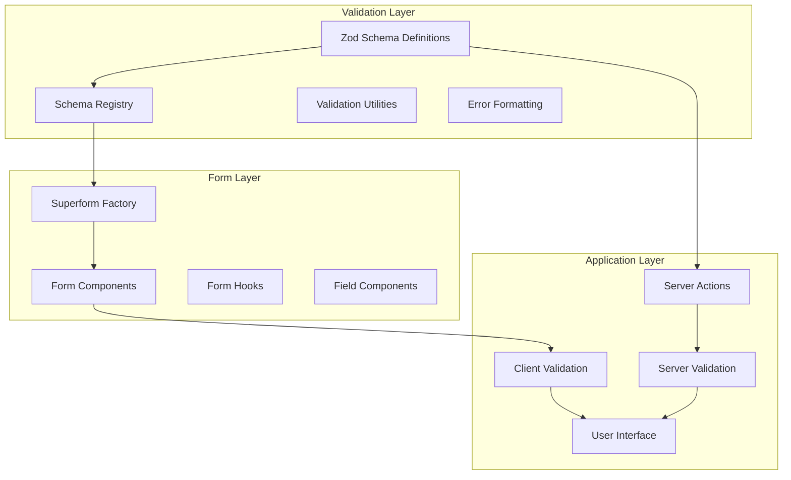

# Design Document

## Overview

This design enhances the existing Zod and Superforms integration in the SvelteKit application by creating a comprehensive, reusable validation system. The current implementation already demonstrates good patterns with individual schema files and form components, but this design will standardize and extend these patterns to create a more robust, type-safe, and developer-friendly validation system.

The system will build upon the existing foundation of:
- Zod v4 for schema validation
- sveltekit-superforms for form handling
- formsnap for enhanced form components
- Existing validation patterns in `src/lib/validation/`

## Architecture

### High-Level Architecture



### Component Architecture

The system will be organized into several key layers:

1. **Schema Layer**: Centralized Zod schema definitions with utilities
2. **Form Factory Layer**: Superform creation and configuration utilities
3. **Component Layer**: Reusable form components with built-in validation
4. **Validation Layer**: Error handling, formatting, and accessibility utilities
5. **Integration Layer**: Server action integration and type safety

## Components and Interfaces

### 1. Enhanced Schema Registry

**Location**: `src/lib/validation/index.ts`

```typescript
interface SchemaRegistry {
  register<T extends z.ZodSchema>(name: string, schema: T): void;
  get<T extends z.ZodSchema>(name: string): T;
  getFormSchema<T extends z.ZodSchema>(name: string): T;
  validate<T>(name: string, data: unknown): ValidationResult<T>;
}

interface ValidationResult<T> {
  success: boolean;
  data?: T;
  errors?: ValidationError[];
}
```

### 2. Superform Factory

**Location**: `src/lib/forms/factory.ts`

```typescript
interface SuperformConfig<T extends z.ZodSchema> {
  schema: T;
  validators: ZodAdapter<T>;
  onUpdate?: (result: FormUpdateResult<T>) => void;
  onError?: (errors: ValidationError[]) => void;
  resetForm?: boolean;
  clearOnSubmit?: boolean;
}

interface FormFactory {
  createForm<T extends z.ZodSchema>(
    config: SuperformConfig<T>
  ): SuperformResult<T>;
}
```

### 3. Enhanced Form Components

**Location**: `src/lib/components/forms/`

```typescript
interface FormFieldProps {
  form: SuperformResult;
  name: string;
  label?: string;
  description?: string;
  required?: boolean;
  disabled?: boolean;
  class?: string;
}

interface ValidationFieldProps extends FormFieldProps {
  validateOn?: 'blur' | 'change' | 'submit';
  showErrors?: boolean;
  errorClass?: string;
}
```

### 4. Validation Utilities

**Location**: `src/lib/validation/utils.ts`

```typescript
interface ValidationUtils {
  formatErrors(errors: z.ZodError): FormattedError[];
  getFieldError(errors: FormattedError[], field: string): string | null;
  validateField<T>(schema: z.ZodSchema<T>, value: unknown): ValidationResult<T>;
  createAsyncValidator<T>(
    validator: (value: T) => Promise<boolean>
  ): z.ZodEffects<z.ZodType<T>>;
}

interface FormattedError {
  field: string;
  message: string;
  code: string;
}
```

## Data Models

### Schema Definition Pattern

Building on the existing pattern but with enhanced structure:

```typescript
// Enhanced schema pattern
export const baseEntitySchema = z.object({
  id: z.string().uuid().optional(),
  createdAt: z.date().optional(),
  updatedAt: z.date().optional(),
});

export const expenseSchema = baseEntitySchema.extend({
  description: z.string()
    .min(5, 'Description must be at least 5 characters')
    .max(200, 'Description must be less than 200 characters'),
  amount: z.number()
    .positive('Amount must be positive')
    .max(1000000, 'Amount cannot exceed $1,000,000'),
  category: z.enum(Object.keys(categorySchema) as [string, ...string[]]),
  status: z.enum(Object.keys(paymentStatusSchema) as [string, ...string[]]),
  date: z.date(),
});

// Form-specific schemas with transforms
export const expenseFormSchema = expenseSchema
  .omit({ id: true, createdAt: true, updatedAt: true })
  .extend({
    date: z.string().pipe(z.coerce.date()),
    amount: z.string().pipe(z.coerce.number().positive()),
  });
```

### Type Generation

```typescript
// Auto-generated types from schemas
export type Expense = z.infer<typeof expenseSchema>;
export type ExpenseForm = z.infer<typeof expenseFormSchema>;
export type ExpenseInput = z.input<typeof expenseFormSchema>;
```

## Error Handling

### Client-Side Error Handling

1. **Real-time Validation**: Field-level validation on blur/change events
2. **Form-level Validation**: Complete form validation before submission
3. **Error Display**: Contextual error messages with proper ARIA attributes
4. **Error Recovery**: Automatic error clearing when fields are corrected

### Server-Side Error Handling

1. **Schema Validation**: Same Zod schemas used on server
2. **Error Serialization**: Structured error responses
3. **Error Mapping**: Server errors mapped to client form fields
4. **Fallback Validation**: Server validation as security fallback

### Error Message Strategy

```typescript
interface ErrorMessageConfig {
  field: string;
  rules: {
    required: string;
    minLength: (min: number) => string;
    maxLength: (max: number) => string;
    pattern: string;
    custom: (value: any) => string;
  };
}
```

## Testing Strategy

### Unit Testing

1. **Schema Testing**: Validate schema definitions with various inputs
2. **Validation Logic**: Test validation utilities and error formatting
3. **Component Testing**: Test form components in isolation
4. **Type Safety**: Compile-time type checking tests

### Integration Testing

1. **Form Submission**: End-to-end form submission workflows
2. **Error Handling**: Error display and recovery scenarios
3. **Accessibility**: Screen reader and keyboard navigation testing
4. **Cross-browser**: Validation behavior across different browsers

### Test Structure

```typescript
// Schema tests
describe('expenseSchema', () => {
  it('should validate valid expense data', () => {
    // Test valid data
  });
  
  it('should reject invalid expense data', () => {
    // Test invalid data scenarios
  });
  
  it('should provide meaningful error messages', () => {
    // Test error message quality
  });
});

// Component tests
describe('ExpenseForm', () => {
  it('should display validation errors', () => {
    // Test error display
  });
  
  it('should clear errors when corrected', () => {
    // Test error recovery
  });
});
```

## Implementation Considerations

### Performance Optimizations

1. **Schema Caching**: Cache compiled schemas to avoid re-compilation
2. **Lazy Validation**: Only validate fields that have been touched
3. **Debounced Validation**: Debounce real-time validation to reduce CPU usage
4. **Selective Re-rendering**: Minimize component re-renders during validation

### Accessibility Features

1. **ARIA Labels**: Proper labeling for form fields and errors
2. **Error Announcements**: Live regions for error announcements
3. **Focus Management**: Proper focus handling for error states
4. **Keyboard Navigation**: Full keyboard accessibility

### Developer Experience

1. **Type Safety**: Full TypeScript integration with inferred types
2. **Auto-completion**: IDE support for schema properties and methods
3. **Error Messages**: Clear, actionable error messages
4. **Documentation**: Comprehensive JSDoc comments and examples

### Migration Strategy

1. **Backward Compatibility**: Maintain existing form functionality
2. **Gradual Migration**: Migrate forms one at a time
3. **Shared Utilities**: Create shared utilities that work with existing patterns
4. **Testing Coverage**: Ensure no regression in existing functionality