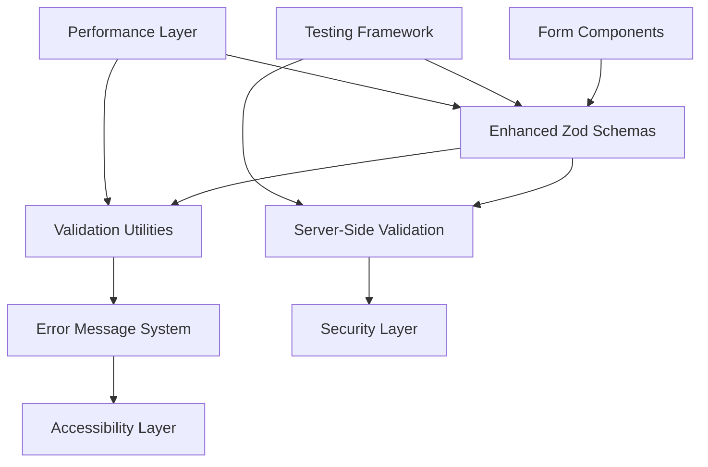
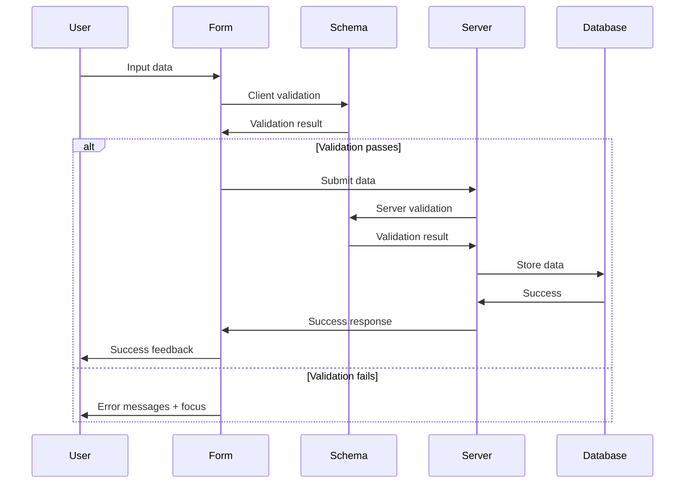

# Design Document

## Overview

The zod-validation enhancement will transform VowsMarry's form validation system into a comprehensive, user-friendly, and secure validation framework. The design focuses on improving the existing Zod v4 implementation with sveltekit-superforms by adding enhanced schema validation, better error messaging, accessibility features, security measures, and comprehensive testing.

The system will maintain backward compatibility while introducing new validation patterns, utilities, and best practices that can be applied across all wedding planning modules and digital invitation features.

## Architecture

### Core Components



### Validation Flow



## Components and Interfaces

### 1. Enhanced Schema System

**Location**: `src/lib/validation/`

**Core Interface**:
```typescript
interface EnhancedValidationSchema<T> {
  schema: z.ZodSchema<T>;
  errorMessages: Record<string, string>;
  sanitizers?: Record<string, (value: any) => any>;
  accessibility?: {
    ariaLabels: Record<string, string>;
    descriptions: Record<string, string>;
  };
}
```

**Key Components**:
- **Base Schemas**: Enhanced versions of existing document, expense, task, vendor schemas
- **Format Validators**: Email, phone, URL, Instagram handle, file type validators
- **Custom Validators**: Date range, conditional field, cross-field validation utilities
- **Composition Utilities**: Reusable schema building blocks

### 2. Validation Utilities

**Location**: `src/lib/validation/utils.ts`

**Core Functions**:
```typescript
// Format validators
export const emailValidator = z.email();
export const phoneValidator = z.string().regex(/^[\+]?[1-9][\d]{0,15}$/);
export const urlValidator = z.url();
export const instagramValidator = z.string().regex(/^@?[a-zA-Z0-9._]+$/);

// File validators
export const fileTypeValidator = (allowedTypes: string[]) => 
  z.instanceof(File).refine((f) => allowedTypes.includes(f.type));

// Date validators
export const dateRangeValidator = (startField: string, endField: string) =>
  z.object({}).refine((data) => data[endField] > data[startField]);

// Sanitization utilities
export const sanitizeHtml = (input: string) => string;
export const sanitizeText = (input: string) => string;
```

### 3. Error Message System

**Location**: `src/lib/validation/messages.ts`

**Structure**:
```typescript
interface ValidationMessages {
  [schemaName: string]: {
    [fieldName: string]: {
      [errorType: string]: string;
    };
  };
}

export const validationMessages: ValidationMessages = {
  vendor: {
    name: {
      required: "Vendor name is required",
      minLength: "Vendor name must be at least 2 characters"
    },
    instagram: {
      required: "Instagram handle is required",
      format: "Please enter a valid Instagram handle (e.g., @username)"
    }
  }
};
```

### 4. Accessibility Layer

**Location**: `src/lib/validation/accessibility.ts`

**Features**:
- ARIA label generation
- Live region announcements
- Keyboard navigation support
- Focus management utilities
- Color contrast validation

### 5. Security Layer

**Location**: `src/lib/validation/security.ts`

**Components**:
- Input sanitization functions
- CSRF token validation
- File upload security checks
- Rate limiting utilities
- XSS prevention measures

## Data Models

### Enhanced Schema Definitions

```typescript
// Enhanced vendor schema example
export const enhancedVendorSchema = z.object({
  name: z.string()
    .min(1, { message: "Vendor name is required" })
    .max(100, { message: "Vendor name must be less than 100 characters" })
    .transform(sanitizeText),
  
  category: z.enum(Object.keys(categorySchema) as [Category, ...Category[]]),
  
  instagram: z.string()
    .min(1, { message: "Instagram handle is required" })
    .regex(/^@?[a-zA-Z0-9._]+$/, { 
      message: "Instagram handle can only contain letters, numbers, dots, and underscores" 
    })
    .transform((val) => val.startsWith('@') ? val : `@${val}`),
  
  email: z.string()
    .email({ message: "Please enter a valid email address" })
    .optional(),
  
  phone: z.string()
    .regex(/^[\+]?[1-9][\d]{0,15}$/, { message: "Please enter a valid phone number" })
    .optional(),
  
  website: z.string()
    .url({ message: "Please enter a valid website URL" })
    .optional(),
  
  price: z.coerce.number()
    .min(0.01, { message: "Price must be greater than 0" })
    .max(1000000000, { message: "Price seems unreasonably high" }),
  
  rating: z.enum(Object.keys(vendorRatingSchema)),
  
  status: z.enum(Object.keys(vendorStatusSchema) as [VendorStatus, ...VendorStatus[]])
    .default('researching'),
  
  notes: z.string()
    .max(1000, { message: "Notes must be less than 1000 characters" })
    .transform(sanitizeHtml)
    .optional()
});
```

### New Schema Types

```typescript
// User authentication schemas
export const loginSchema = z.object({
  email: z.string().email({ message: "Please enter a valid email address" }),
  password: z.string().min(8, { message: "Password must be at least 8 characters" })
});

export const registrationSchema = loginSchema.extend({
  confirmPassword: z.string(),
  firstName: z.string().min(1, { message: "First name is required" }),
  lastName: z.string().min(1, { message: "Last name is required" })
}).refine((data) => data.password === data.confirmPassword, {
  message: "Passwords don't match",
  path: ["confirmPassword"]
});

// Guest management schemas
export const guestSchema = z.object({
  name: z.string().min(1, { message: "Guest name is required" }),
  email: z.string().email().optional(),
  phone: z.string().regex(/^[\+]?[1-9][\d]{0,15}$/).optional(),
  rsvpStatus: z.enum(['pending', 'attending', 'not-attending']).default('pending'),
  dietaryRestrictions: z.string().max(500).optional(),
  plusOne: z.boolean().default(false)
});

// Budget schemas
export const budgetCategorySchema = z.object({
  name: z.string().min(1, { message: "Category name is required" }),
  budgetAmount: z.coerce.number().min(0, { message: "Budget must be 0 or greater" }),
  actualAmount: z.coerce.number().min(0).default(0)
});

// Schedule/rundown schemas
export const scheduleEventSchema = z.object({
  title: z.string().min(1, { message: "Event title is required" }),
  startTime: z.string().regex(/^([0-1]?[0-9]|2[0-3]):[0-5][0-9]$/, { 
    message: "Please enter time in HH:MM format" 
  }),
  endTime: z.string().regex(/^([0-1]?[0-9]|2[0-3]):[0-5][0-9]$/, { 
    message: "Please enter time in HH:MM format" 
  }),
  description: z.string().max(500).optional(),
  location: z.string().max(200).optional(),
  responsible: z.string().max(100).optional()
}).refine((data) => data.endTime > data.startTime, {
  message: "End time must be after start time",
  path: ["endTime"]
});
```

## Error Handling

### Error Message Strategy

1. **Context-Specific Messages**: Each field has tailored error messages that explain what's wrong and how to fix it
2. **Progressive Disclosure**: Show the most relevant error first, with additional context available
3. **Internationalization Ready**: All messages use keys that can be translated
4. **Consistent Tone**: Friendly, helpful tone across all messages

### Error Display System

```typescript
interface ValidationError {
  field: string;
  message: string;
  type: 'required' | 'format' | 'range' | 'custom';
  severity: 'error' | 'warning';
  ariaLabel?: string;
}

interface FormValidationState {
  errors: ValidationError[];
  isValid: boolean;
  firstInvalidField?: string;
  touchedFields: Set<string>;
}
```

### Error Recovery

- Auto-focus on first invalid field
- Clear errors as user corrects them
- Provide suggestions for common mistakes
- Save valid data to prevent loss during correction

## Testing Strategy

### Unit Testing

**Location**: `src/lib/validation/__tests__/`

**Coverage**:
- Schema validation for all field types
- Custom validator functions
- Error message generation
- Sanitization functions
- Edge cases and boundary values

**Example Test Structure**:
```typescript
describe('Enhanced Vendor Schema', () => {
  it('should validate correct vendor data', () => {
    const validData = {
      name: 'Test Vendor',
      instagram: '@testvendor',
      price: 1000,
      // ... other fields
    };
    expect(enhancedVendorSchema.parse(validData)).toEqual(validData);
  });

  it('should reject invalid Instagram handles', () => {
    const invalidData = { instagram: 'invalid@handle!' };
    expect(() => enhancedVendorSchema.parse(invalidData)).toThrow();
  });
});
```

### Integration Testing

**Coverage**:
- Complete form submission flows
- Client-server validation consistency
- Error message display and accessibility
- Form state management
- Auto-save functionality

### Accessibility Testing

**Tools**: axe-core, jest-axe
**Coverage**:
- ARIA attributes presence and correctness
- Keyboard navigation
- Screen reader announcements
- Color contrast validation
- Focus management

### Performance Testing

**Metrics**:
- Schema compilation time
- Validation execution time
- Bundle size impact
- Memory usage during validation

## Security Considerations

### Input Sanitization

- HTML sanitization for rich text fields
- SQL injection prevention through parameterized queries
- XSS prevention through output encoding
- File upload validation (type, size, content)

### CSRF Protection

- Token validation on all form submissions
- SameSite cookie configuration
- Origin header validation

### Rate Limiting

- Form submission rate limits
- API endpoint protection
- User session management

### Data Validation

- Server-side validation mirrors client-side
- Database constraint validation
- Input length and type restrictions
- File upload security scanning

## Performance Optimizations

### Schema Caching

```typescript
const schemaCache = new Map<string, z.ZodSchema>();

export const getCachedSchema = (key: string, factory: () => z.ZodSchema) => {
  if (!schemaCache.has(key)) {
    schemaCache.set(key, factory());
  }
  return schemaCache.get(key)!;
};
```

### Debounced Validation

```typescript
export const createDebouncedValidator = (
  schema: z.ZodSchema,
  delay: number = 300
) => {
  return debounce((value: unknown) => {
    return schema.safeParseAsync(value);
  }, delay);
};
```

### Bundle Optimization

- Tree-shaking unused Zod features
- Lazy loading of complex validators
- Code splitting for form-specific schemas
- Compression of error message strings

## Migration Strategy

### Phase 1: Core Enhancements
- Enhance existing schemas with better error messages
- Add format validators (email, phone, URL)
- Implement basic accessibility features

### Phase 2: New Features
- Add authentication schemas
- Implement guest management validation
- Create budget and schedule schemas

### Phase 3: Advanced Features
- Add comprehensive testing
- Implement performance optimizations
- Add security enhancements
- Complete accessibility compliance

### Backward Compatibility

- Existing schemas remain functional
- Gradual migration of forms to enhanced schemas
- Feature flags for new validation features
- Deprecation warnings for old patterns